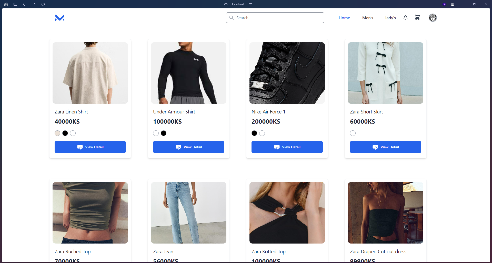
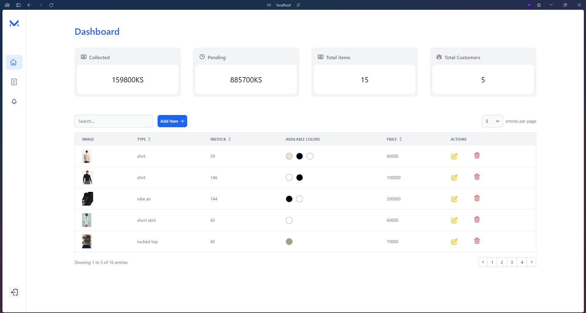

# Clothing Store

## Desccription

This project was developed as part of a school assignment at the University of Computer Studies, Taunggyi, over a two-month period. Our goal was to create an efficient and user-friendly solution using modern web development technologies.

## Features
- **Core Functionality**: [Briefly describe the main feature(s) of your project]
- **Tech Stack**:
  - Frontend: [Javascript,php]
  - Backend: [Php,Mysql]
  - Styling: [TailwindCSS, MerakiUI, Bootstrap]

## Team
- **[Khun Thi Han](https://github.com/Tomoe-12)** - *Frontend Developer*:  
  Focused on crafting the user interface and ensuring a smooth, responsive experience. Implemented modern web technologies to create an intuitive and attractive UI.
   [GitHub Profile]

- **[Mg Zayar Lin Htun](https://github.com/zayar123455666)** - *Backend Developer*:  
  Managed server-side logic, API development, and integration. Ensured efficient data handling and secure communication between the frontend and backend.

- **[Mg Nyein Chan Oo](https://github.com/nyeinchanoo215)** - *Database Administrator*:  
  Designed and managed the database, ensuring optimal performance and data integrity. Handled data modeling and query optimization for efficient access.

## Goals & Challenges
During the project, we aimed to:

Learn and apply new web development techniques.
Implement efficient database interactions and responsive UI designs.

## Screenshots

### 1. User Interface

### 2. Admin Dashboard

